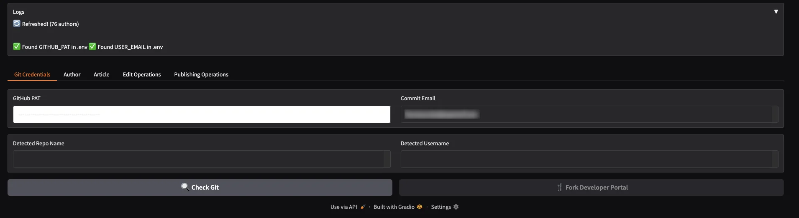
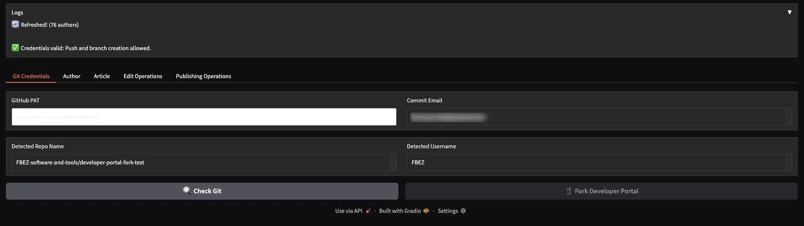
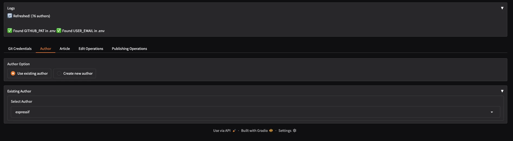
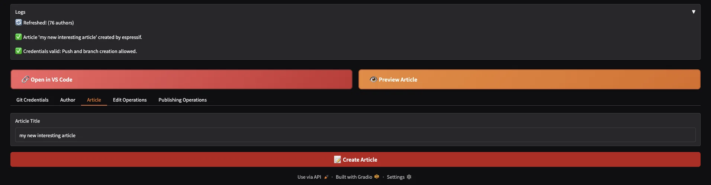
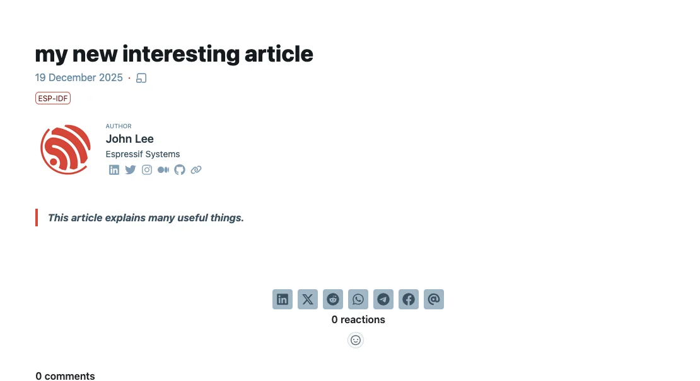
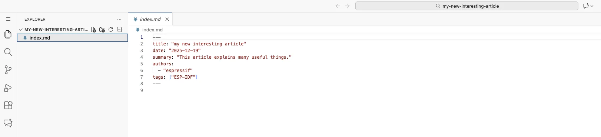
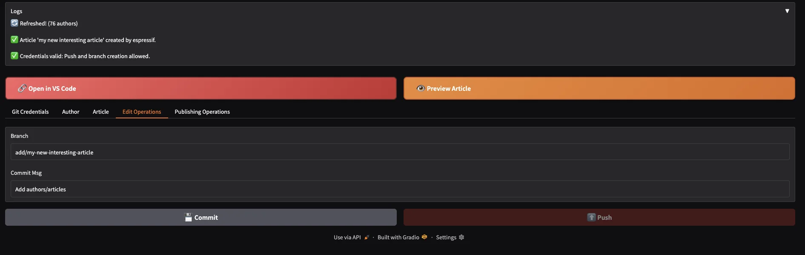
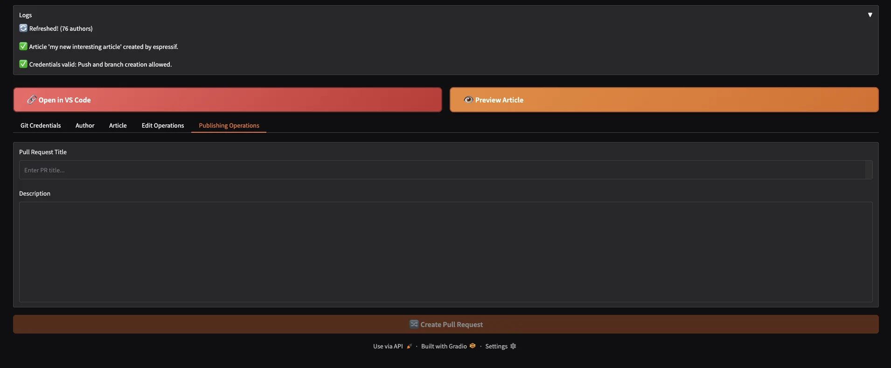

# Basic Developer Portal Article Creation Helper

This repository contains a simple **Gradio** application designed to speed up the boilerplate scaffolding required when creating articles for the [Espressif Developer Portal](https://developer.espressif.com/).

> [!NOTE]
> This application is a proof of concept. It is not intended to be the foundation of the final product, which will likely use a different framework and overall architecture.

## What this app does

The application currently supports the following actions:

1. Creates a dedicated branch for your article
2. Generates all required files for a new article (and author, if needed)
3. Commits the generated changes

Other [useful features](#todo-in-the-final-app) are not yet implemented.

## Get started

1. Fork this repository on GitHub (or GitLab).
2. Navigate into your working directory:

   ```bash
   cd repo
   ```
3. Clone your forked repository inside the `repo` folder using:

   ```bash
   git clone --recursive --shallow-submodules <your_username>/<your_fork_repo_name>
   ```
4. Generate a GitHub *Personal Access Token (PAT)*.
   You can follow [this guide](https://dev.to/warnerbell/how-to-generate-a-github-personal-access-token-pat-1bg5).
5. Start the application using Docker Compose:

   ```bash
   docker compose up -d
   ```
6. Open your browser and go to:

   ```
   http://localhost:7860/
   ```

## Usage steps

1. **Tab 1**
   Check your credentials by running `check git`. Your GitHub username and repository name should be displayed.

2. **Tab 2**
   Select an existing author from the list or create a new one.
   *Adding an author image is not supported yet.*

3. **Tab 3**
   Provide an article title and create the article. Two actions become available:

   * Preview the article using `hugo`
   * Edit the article using `VS Code`

4. **Tab 4**
   Add a commit with a message.
   *Pushing changes is not implemented yet.*

5. **Tab 5**
   Publish your article.
   *Pull request creation is not implemented yet.*

## `.env`

Configuration and credentials are stored in the `.env` file. You can either set them directly through the interface or define them manually beforehand:

```bash
GITHUB_PAT='ghp_<your_pat>'
USER_EMAIL='tityre.tu@patulae.sub'
```

## Todo (final app)

* [ ] Allow users to fork the repository directly from the interface
* [ ] Implement and validate the push functionality
* [ ] Implement and validate pull request creation


## Screenshots

### First tab: Git credentials

#### Initial screen



#### Check git credentials



### Second tab: Author selection or creation



### Third tab: Article Creation

#### Created new article 



#### Preview in hugo



#### Edit in vscode server




### Fourth tab: Editing 



### Fifth tab: Publishing

